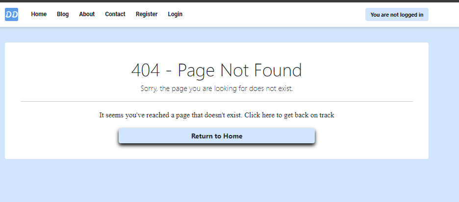

 
# Table of contents

- [Table of contents](#table-of-contents)
- [Project Planning](#project-planning)
  - [Site Goal](#site-goal)
  - [Targeted Audience](#targeted-audience)
  - [Wireframes](#wireframes)
  - [Database Schema](#database-schema)
  - [Color Scheme](#color-scheme)
  - [Typography](#typography)
- [Agile Development Process](#agile-development-process)
- [Features](#features)
  - [Navigation | Logo | Favicon](#navigation--logo--favicon)
    - [Logo Details | Favicon](#logo-details--favicon)
    - [Navigation](#navigation)
      - [Navigation Components](#navigation-components)
      - [Design and Functionality](#design-and-functionality)
      - [Navigation Items for User Status](#navigation-items-for-user-status)
  - [Blog Page | Blog App](#blog-page--blog-app)
      - [Blog Page](#blog-page)
      - [User access to blog content | ability to make comments](#user-access-to-blog-content--ability-to-make-comments)
      - [Individual Blogpost](#individual-blogpost)
  - [About Page | About App](#about-page--about-app)
  - [Feature ABCD](#feature-abcd)
  - [Feature ABCD](#feature-abcd-1)
  - [Customized 404 Error Page](#customized-404-error-page)
    - [Key Features of the Customized 404 Page:](#key-features-of-the-customized-404-page)
- [Technologies](#technologies)
  - [Django-based technologies](#django-based-technologies)
- [Bugs and issues](#bugs-and-issues)
- [Testing](#testing)
  - [Automated Testing](#automated-testing)
  - [Manual Testing](#manual-testing)
- [Security Features](#security-features)
  - [SECURITY](#security)
- [Credits](#credits)
  - [Code](#code)
  - [Content Data Sources](#content-data-sources)
- [Deployment](#deployment)
  - [Steps before deployment | Update code for deployment](#steps-before-deployment--update-code-for-deployment)
  - [Deployment on Heroku (step-by-step guide)](#deployment-on-heroku-step-by-step-guide)
  - [Local Development](#local-development)
    - [How to Fork the project](#how-to-fork-the-project)
    - [How to Clone the Project](#how-to-clone-the-project)

# Project Planning
	
This is project milestone 4 for the Code Institute full-stack development program. The project is a full-stack website built using the Django framework.

The live site deployed on Heroku can be found here: **[Dividend Dynamics](https://dividend-blog-app-7524309b6f0c.herokuapp.com/)**
 
## Site Goal
The goal of the Dividend Shares Blog App is to provide comprehensive, reliable, and insightful information about companies that have a strong track record of paying dividends. The blog content aims to serve as a resource for investors looking to build or manage a dividend-focused investment portfolio. By delivering short summaries of analysis on dividend-paying companies, the blog content helps users with ideas of potential investments to be investigated further.

## Targeted Audience
The targeted personas of the blog app are broad and include personas such as long-term investors familiar with the dividend shares investment style, personas seeking information about stocks with higher dividend growth prospects than already owned, or personal investors new to the investment style of dividend shares.

All personas have some or all of the following interests:
-	Stable income streams through dividend-paying stocks
-	Accumulation of wealth for retirement
-	Information about long-term track record of dividend-paying stocks with dividend histories and analyses
-	Reinvestment of dividend income to achieve compounded returns on investments
-	Identification of stocks with a track record of increasing dividend payments over prolonged periods
-	Information about the basics of dividend investing and building financial literacy

The dividend blog app caters to the information needs of users as follows:
-	Educational content on dividend investing fundamentals
-	Explains beginner-friendly dividend-paying stocks with low risk
-	Offers the opportunity to share thoughts on specific dividend investment ideas via a comment function and get engaged in a discussion with other users

## Wireframes
	
## Database Schema

The database model (Entity Relationship Diagram | ERD) describes the connection among the different models used in the site
	
## Color Scheme

The dividend blog app uses a color scheme to convey professionalism and trustworthiness. Both are key characteristics of finance-related content.
The blue color is associated with trust, stability, and professionalism and is widely used in the financial sector. The credibility of the content is supported by the use of this key color for headlines, titles, and important text elements. Gray is used as a contrast color. The gray color is neutral and symbolizes maturity, calmness, and sophistication. The gray colors are used for standard text to ensure readability and to complement and contrast the headline and title color. Gray is also used for background elements to support the main content.

While developing the app a lighthouse test resulted in a bad score for the initial color scheme. Therefore, the final color scheme as shown below was chosen to ensure sufficient contrast and the est possible accessibility.

## Typography

For my application, I selected Roboto and Times New Roman to enhance both visual appeal and readability. Times New Roman is chosen for body text due to its serif style, which conveys tradition, reliability, and professionalism—key attributes for a finance-related blog.

On the other hand, Roboto is used for headlines and titles. As a modern sans-serif font, Roboto provides a clean and contemporary look, ensuring excellent legibility on screens. Its straightforward design makes it ideal for drawing attention to important information while maintaining a sleek appearance.

The pairing of Times New Roman's traditional reliability with Roboto's modern clarityenhances readability and user engagement, offering a visually appealing and functional design for the financial content.

	
# Agile Development Process

Details on the agile development process can be found here **[agile.md](agile.md)**

# Features

## Navigation | Logo | Favicon

The project features a user-friendly navigation system designed to enhance the overall experience. A key component of this navigation is the **logo**, which is seamlessly integrated into the layout.

### Logo Details | Favicon

- **Design Consistency**: The logo's style is intentionally aligned with the navigation icon (navicon), ensuring a cohesive visual identity across the entire application
  
- **Functionality**: The logo, when clicked, will reroute users back to the **landing page**. This feature provides a convenient way for users to return to the starting point of their journey within the application.

### Navigation

The application features an intuitive navigation system designed to enhance user experience. Below is a detailed description of the navigation components and their functionalities

#### Navigation Components

- **Navigation Items**: The navigation bar includes items that provide links to key sections of the application. Each item is labeled to help users find what they need quickly

- **Login Status**: The navigation also displays the user's login status. This feature allows users to easily see whether they are logged in and provides relevant options based on their authentication status

#### Design and Functionality

- **Consistent Styling**: The background color of navigation items is dynamically updated to match the main background color used throughout the application

#### Navigation Items for User Status

The navigation items differ based on the user's login status

- **Not Logged-In Users**: For users who are not logged in, the navigation includes items that direct the user to the blog page, login page, registration, about and contact

- **Logged-In Users**: For users who are logged in, the navigation displays additional 

## Blog Page | Blog App

The Blog Page is designed to enable users to view and interact with the blog post content. 

#### Blog Page

- **Display of All Blog Posts**: A dedicated blog page where all published blog posts are displayed. Users can easily scroll and paginate through the available content

#### User access to blog content | ability to make comments

- **Unregistered Users**: Both unregistered and registered users can view blog posts individually. This allows anyone to access the content

- **Registered Users**: While registered users can view all blog posts, only registered users have the ability to comment on posts. Comments on blog posts need approval by admin before the comment is made public to all other users on the blogpost page. The registered user is displayed the comments already made and still subject to approval by admin with message of either "approved" or "pending approval"

#### Individual Blogpost

Logged-in users have the ability to make comments on blog posts. The features on commenting are:

- **Comment Submission**: Registered users can submit comments on individual blog posts. However, comments submitted are not visible to other users until they are approved by an admin.

- **Pending Approval Notification**: Once a user submits a comment, the user receives a notification indicating that the comment is pending approval. This ensures transparency to the contributing user regarding the status of their submission

- **Approval Status Labels**: Comments awaiting approval are displayed with the label **"pending approval."** Once a comment has been approved by the admin, it is updated with the label **"approved."** This distinction helps users to understand the status of their comments

- **Edit and Delete Options**: Registered users also have the ability to edit or delete comments that have been previously approved by the admin. This feature provides users with control over their contributions

- **Returning to the Blog Page**: For convenience, users can easily navigate back to the main blog page that displays all blog posts. Each individual blog post includes a button that, when clicked, takes the user back to the blog listing page

## About Page | About App

The blog application includes a dedicated About page that provides information about the blog, its purpose, and its creators. This page can be managed and populated by an admin through a model interface. The admin panel for admin users can access the About model.

- **Admin Interface**: Admin users have access to a dedicated interface where they can create, edit, and delete content for the About page. Changes made by the admin are immediately reflected on the About page
  
- **Rich Text Support**: The About page can include formatted text or an image to enhance the information presented

- **Frontend**: The About page is designed to be visually consistent with the remainder of the application and includes a link to all blogposts to guide the user to the important content of the application

- **Access Control**: Only authenticated admin users (superusers) have the permission to access or modify the content of the About page.

## Feature ABCD

## Feature ABCD

## Customized 404 Error Page

To enhance user engagement and experience, a customized 404 error page has been implemented. This approach prevents the display of generic error messages and ensures that users encountering errors are provided with a more informative and user-friendly response.

### Key Features of the Customized 404 Page:

- **User Engagement and Experience**:
  - The customized 404 page is designed to support user engagement by providing a more tailored response to errors, avoiding the display of a generic error message.
  - It helps maintain user satisfaction by offering clear and helpful feedback when an error occurs.

- **Design Integration**:
  - The 404 page design is fully integrated with the overall design of the website, ensuring a consistent look and feel. 
  - It allows users to easily navigate back to the page where the error was encountered, minimizing disruption to their experience.

- **User-Centric Approach**:
  - This user-centric design reinforces the website’s commitment to providing a good user experience.

# Technologies

This is a full-stack (front-end/back-end) project with the primary use of HTML, CSS, and Python. The backend uses the Python framework Django.

The frontend primarily relies on the CSS framework Bootstrap for the efficient layout of mobile-first responsive design (MFRD).

## Django-based technologies

**[Django](https://www.djangoproject.com/)** Django is an open-source web framework for building robust and dynamic web applications

**[AllAuth](https://docs.allauth.org/en/latest/)** A Django package with views and templates for features such as authentication, registration, or account management

**[Cloudinary](https://cloudinary.com/)** Cloudinary is an image/video management solution for websites to easily upload images to the cloud with the delivery of media files through a fast content delivery network (CDN)

**[CrispyForms](https://pypi.org/project/django-crispy-forms/)** Crispy Forms is a third-party Django app to manage Django forms with Bootstrap styles		

**[Crispy Bootstrap5](https://pypi.org/project/crispy-bootstrap5/)** Crispy Bootstrap5 is a Bootstrap template pack for Django Crispy Forms

**[Summernote](https://summernote.org/)** Summernote is a JavaScript library that allows to create a WYSIWYG (What You See Is What You Get) editor

**[Gunicorn](https://gunicorn.org/)** Gunicorn is a Python WSGI HTTP Server for UNIX. WSGI stands for Web Server Gateway Interface and is a specification for communication between web servers and Python web applications. Gunicorn is the equivalent of 'manage.py runserver' used in the development but with speed and security optimization

**[psycopg2](https://pypi.org/project/psycopg2/)** Pycopg2 is a PostgreSQL database adapter for the Python programming language

**[Whitenoise](https://whitenoise.readthedocs.io/en/stable/index.html)** Whitenoise is a Python package that allows the Heroku app to serve its own static files without relying on an external file hosting service such as a content delivery network (CDN)
															
**[CoideInstitutePostgreSQL](https://dbs.ci-dbs.net/)** PostgreSQL from Code Institute to create a database

**[Browserling](https://www.browserling.com/)** Browserling is a web-based cross-browser testing software that allows users to test the website across desktop and mobile browsers such as Chrome, Firefox, Edge, or Opera without downloading and installing the respective browser

**[CI Python Linter](https://pep8ci.herokuapp.com/)** The Code Institute Python Linter was used to validate Python code	

**[Favicon](https://favicon.io/favicon-generator/)** Favicon generates favicons						

**[GitHub](https://github.com/)** The code files, README files, and assets are stored on GitHub. The code on GitHub was pushed from Git				

**[Git](https://git-scm.com/)** The version control system Git was used to document the development of the application and to push code to the GitHub repository. The specific reasons for the commit are reflected in the respective commit message

**[Heroku](https://www.heroku.com/)** Heroku is a platform as a service (PaaS) to build, run, and operate cloud-based applications. It was used to deploy the website

**[Lucid Chart](https://www.lucidchart.com/pages/)** Lucid Chart is a web-based diagramming tool to create flowcharts, wireframes, and visualisation of concepts							

**[Python](https://www.python.org/)** Python is an interpreted, high-level general-purpose programming language	

**[Techsini](https://techsini.com/multi-mockup/)** Multi Device Website Mockup generator				

**[Tinypng](https://tinypng.com/)** To reduce the size of the images used and improve lighthouse score on performance				

**[Visual Studio Code](https://code.visualstudio.com/)** Visual Studio Code (VS-Code) was used as an integrated development environment (IDE) for the entire project. The GitHub repository was cloned to VS-Code for this purpose			

# Bugs and issues

**Erroneously Renaming Django Project Folder**

After the initial set-up of the Django project, I wanted to test the deployment in Heroku using the django project name 'testproject'. It was a fully erroneous assumption that a simple change of the Django project name with a change of the project folder to 'diviblog' will keep my django project running. I learned that hard way that I have to review and adjust the wsgi.py, asgi.py, manage.py and settings.py with the new app name that I assigned to the existing Django project originally named 'testproject'.

**HTML tag rendering in single_post.html for individual posts clicked**

My 'bold' HTML -tag included in the posts.json in fixtures for the blog body (content) did initially not render on the single_post.html page. I reviewed the |safe filter to ensure that Django is not escaping the HTML-tag for XSS reasons

**static/css/style.css only partly working on classes defined in 404.html**
For my 404.html I defined classes in the markup of the 404.html. I did load static and connect the stylesheet correctly from static/css/style.css. Nevertheless, the styles in
my style.css were only PARTLY applied to the 404.html. Some styles affected the 404.html, some did not. I change class names in 404.html to be as distinctly different from bootstrap classes as possible to avoid that bootstrap is over-riding my custom CSS for the 404.html page but this did likewise not work. I decided to make the the styles of the 404.html with an internal stylesheet inside the 404.html and everything worked out well. Adds some more complexity maintaining the code as I have defined custom properties in
my CSS stylesheet and when one of these custom properties such as colors changes, the internal stylesheet of the 404.html would need additional attention to synchronise colors with potentially changed colors of my custom CSS defined in the :root of my CSS stylesheet

**Debug on False and change of styles in style.css**
After running a deployment test on heroku I did not reset the debug to True. I tried to change some of my custom styles in my style.css but none of the new styles in the stylesheet was applied. I increased specificity of CSS styles and even emptied the entire style.css for testing purposes only to learn that my "old" styles from the style.css are still applied. Puzzled by the fact that styles are applied even if a stylesheet is entirely empty but correctly connected, I stopped development for the day. Rethinking the issue while the code editor was turned off, I speculated that django was using the stylesheet inside the staticfiles as my debug of FALSE was in "production mode". Quite logically, I can change my style.css as much as I want to with no effect as long as Django is using the style.css from staticfiles with debug on FALSE. I changed debug back to TRUE and all my issues with style.css were resolved. Do not really know whether my theory is correct but all simple changes in styles were done once I changed the DEBUG back to true.

# Testing

## Automated Testing

1. **[W3C Markup Validation Service](https://validator.w3.org/) - HTML Validation**
The W3 HTML validator was used throughout the developmeht phase to ensure consistency with HTML standards. All site pages were tested with official W3C validator for both users logged in and those not logged in. HTML validation was done with the renedered pages. The reason for this is that W3C validation does not recognize Django template language (DTL).

This is/will be several screenshots of all the respective pages / subfolder needed

2. **[W3C Jigsaw](https://jigsaw.w3.org/css-validator/) - CSS Validation**

The CSS stylesheet was tested with the W3C CSS validator. No error messages or syntactical errors.

3. **[CI Python Linter](https://pep8ci.herokuapp.com/)** The Code Institute Python Linter was used to validate Python code

This is/will be several screenshots of all the respective pages / subfolder needed

4. **[Google Lighthouse](https://developers.google.com/web/tools/lighthouse)**

Performance of pages, best practices and SEO was tested for every page with Lighthouse.

This is/will be several screenshots of all the respective pages / subfolder needed

## Manual Testing

# Security Features

## SECURITY

- **User Authentication**:
  - Only superusers can access the admin panel; normal users do not have access.

- **Secret Keys Management**:
  - All `SECRET_KEY` values are stored separately in an `env.py` file and in config vars on Heroku.
  - The `env.py` file is excluded from version control using `.gitignore`, ensuring that sensitive information is not exposed on GitHub.
  - A new `SECRET_KEY` was generated using a `secret_key` generator after the initial setup of the `.gitignore` and `env.py` file for enhanced security.

- **Environment Variables**:
  - Critical environment variables such as `DATABASE_URL` and `CLOUDINARY_URL` are stored in the `env.py` file and as config vars on Heroku for secure access.

# Credits

## Code

Reference to the learning material used for the contact form: https://pythonguides.com/contact-form-with-django-and-sqlite/

The custom `404.html` page was created using the guidance from **[Create_Custom_404_error_page](https://www.makeuseof.com/create-custom-404-error-page-django/).**

The Readme.md file follows the structure of Readme.md provided by Code Institute **[Code Institute readme template](https://github.com/Code-Institute-Solutions/readme-template)**. 

The video titled **[README.md - Manual Testing Write Up Overview](https://www.youtube.com/watch?v=Q66HZgkDSOo)** by Kasia Bogucka made it easy to structure the README section on testing.

The video titled **[README.md - How, What and When?](https://www.youtube.com/watch?v=l1DE7L-4eKQ)** by Kasia Bogucka.

The video titled **[Guide to Github Aigle Tool](https://www.youtube.com/watch?v=U_dMihBgUNY&list=PL_7334VduOHsrWzhu5Ta2lrkp016kcBWY&index=20)** by Kasia Bogucka helped to understand the organisation of the agile development process. 

The video titled **[Community Q&A: Validating Your Code Before Project Submission]((https://www.youtube.com/watch?v=wiqAvRCheKo&list=PL_7334VduOHsrWzhu5Ta2lrkp016kcBWY&index=17))** by Code Institute provided good instructions on code validation/linter. Validation of HTML, CSS, Python, and Javascript was done throughout the project development and not just at the end of the project.

The video titled **[Guide to MVP](https://www.youtube.com/watch?v=vIv1c6RLBac)** by Kasia Bogucka provided additional insights and understanding to the PP-4 specifications and project requirements.

The video titled **[Community Q&A: PP4 Project FAQ's](https://www.youtube.com/watch?v=Q5cdZXomzVg)** was used to have some more clarity about the project requirements.

Notes from the call **"Community Q&A: Mastering Full Stack Applications: Your Way to PP4 Success"** webinar held on July 30, 2024.

## Content Data Sources

The dividend history and stability information presented in this blog app are sourced from **[Aktien Guide](https://aktien.guide/dividendenadel)**, a comprehensive resource for dividend data. Company descriptions are derived from official company websites and reputable public sources to ensure accuracy and reliability. This approach ensures that the content provided is both informative and up-to-date.

# Deployment

The code for this project was written in visual studio code integrated development environment. Github was used for version control. The application is deployed to Heroku from the GitHub repository.	

The deployed app can be found here **[Final_Project](https://dividend-blog-app-7524309b6f0c.herokuapp.com/)**
    
## Steps before deployment | Update code for deployment
    
1. Install production-ready web server for Heroku
Use 'pip3 install gunicorn' in your development environment
Add gunicorn installed to the requirements.txt file with 'pip3 freeze --local > requirements.txt'
Gunicorn is a production equivalent of the manage.py runserver used in development
    
2. Configuration of python modules
With 'pip3 freeze --local > requirements.txt' the packages for deployment have already been installed
    
3. Create a file named Procfile at the root directory of the Django project
Ensure that the file named Procfile sits at same directory-level as requirements.txt
The Procfile ensures that Heroku is configred to be a gunicorn web application
Inside the Procfile add the following code: web: gunicorn PROJECT_NAME.wsgi
Ensure to have a space after the colon | Use the name of your Django project for the placeholder PROJECT_NAME (iny my case diviblog.wsgi)
The command gunicorn MY_PROJECT.wsgi is used by Heroku to start the server (for my project, Heroku is using diviblog.wsgi)
    
4. Ensure that environment variables are stored in env.py file
Unless created already, create a file named env.py at the root directory to store environment variables|sensitive and secret information
To ensure that secret information|sensitive information is not leaking, the env.py file must be included in .gitignore
Include the environment variables listed below in the Heroku deployment
    
5. Adjust the settings.py in your Django project
In the settings.py, the Heroku hostname must be appended to the ALLOWED_HOST list
Add Heroku to the ALLOWED_HOST list by adding '.herokuapp.com' to ALLOWED_HOSTS in settings.py
Remember to add a dot before herokuapp.com
Once name of Heroku app is known, the settings.py can be adjusted as follows:
    
6. Set the DEBUG to False
Before committing and pushing of changes to GitHub it is of utmost importance to adjust settings.py
Inside settings.py of the Django project, set DEBUG = False, i.e. replace DEBUG = True with DEBUG = False
    
## Deployment on Heroku (step-by-step guide)
    
1. Log in to Heroku under **[Heroku](https://id.heroku.com/login)**
2. In the Heroku dashboard, click the button **"Create new app"**.
3. Assign a unique name to your app. Names of apps existing already are not considered unique.
4. Select the region (for this project, Europe was selected).
5. Click **"Create app"**.
6. The deployment method must be selected. For this project, GitHub was used as the deployment method.
7. Search for the name of the GitHub repository to be deployed.
8. Click on **"Connect"** to connect Heroku with the GitHub repository.
9. Under the options of either manual or automatic deployment, the **"main branch"** must be selected.
10. In the tab named **"Settings"**, select the **Config Vars**. Config Vars is Heroku's name for environment variables.
    - Inside the Config Vars, set the following:
      - **SECRET_KEY** and its value from the `env.py` file that was ignored with `.gitignore`.
      - **DATABASE_URL** and its value (the database URL) from the `env.py` file that was ignored with `.gitignore`.
      - **DISABLE_COLLECTSTATIC** with a value of `1` initially. For final deployment and once static files are collected, this must be removed.
11. Final Step:
    - The last step is to click **"Deploy Branch"** in the section named **"Manual deploy"**.
    - This will start the build process in Heroku. Once the build process is completed successfully, a link is shown to view the deployed app.

## Local Development

### How to Fork the project

1. Log in or Sign Up on GitHub
2. The repository of this project can be found at **[Project Repository](https://github.com/Werner-Staeblein/Project-4)**
3. The "Fork" button is a the top right of the page. The "Fork" button is located immdiately left to the button ***Star***. Click on the button named "Fork"
4. A new page titled "Create a new fork" will be shown
5. At the bottom of the new page click on "Create fork"
6. With steps 1. to 5. completed, a copy of the project exists in your list of repositories

### How to Clone the Project

1. Log in or Sign Up on GitHub
2. The repository of this project can be found at **[Project Repository](https://github.com/Werner-Staeblein/Project-4)**
3. Click on button named "Code" button. Here, you can choose a clone method (HTTPS, SSH, Github CLI). The link provided must be copied
4. In your code editor navigate to the directory where you would want to clone the repository
5. In the terminal of your code editor, type 'git clone'. Here, the copied link must be pasted. Finish the step by pressing Enter