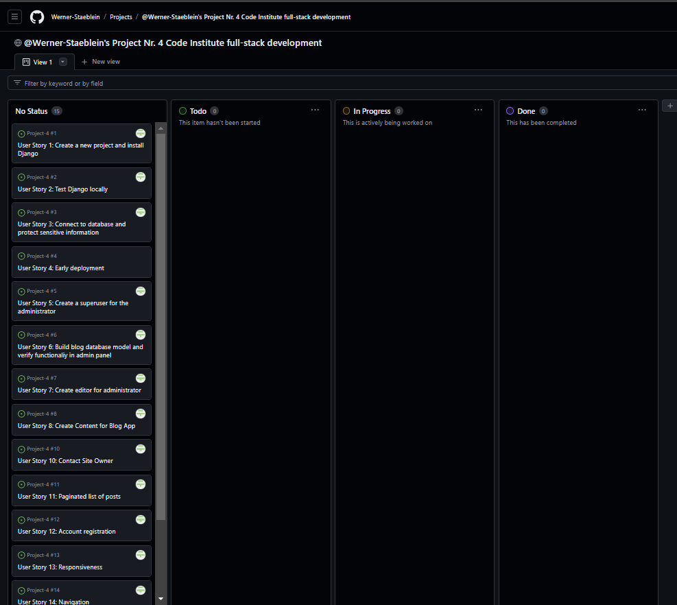
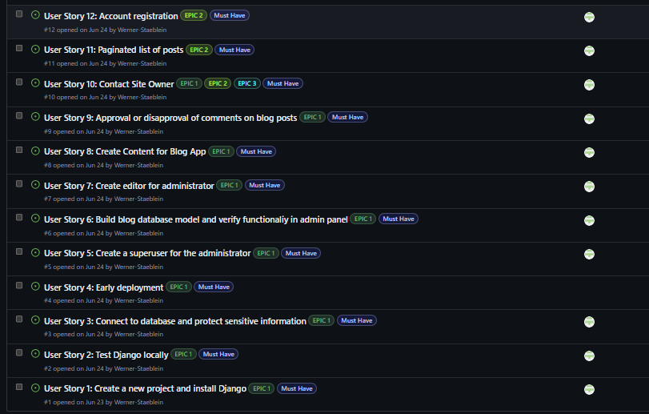
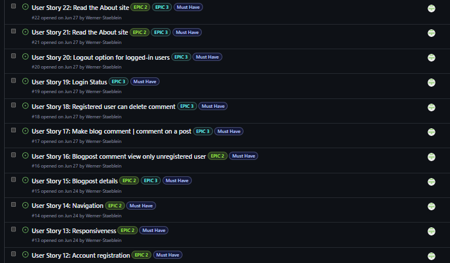
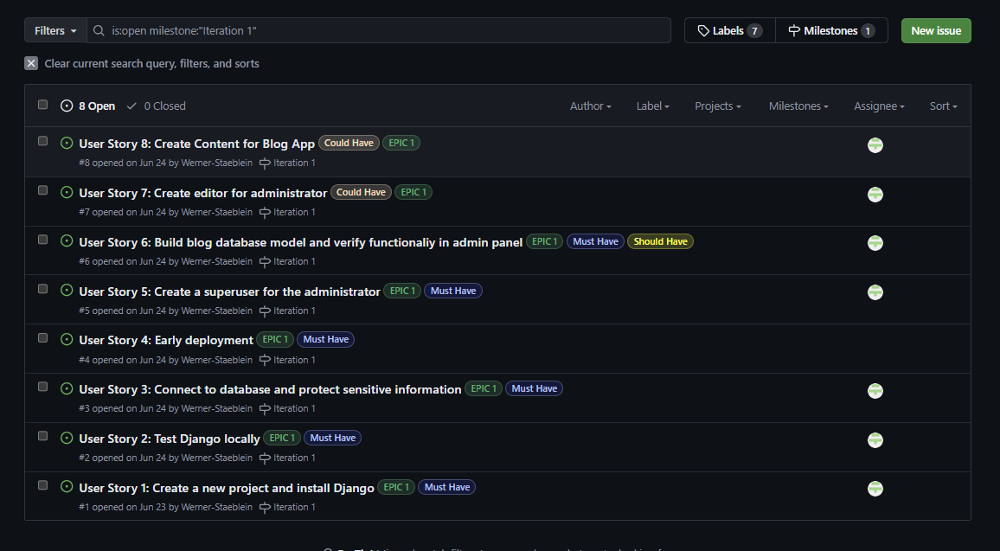
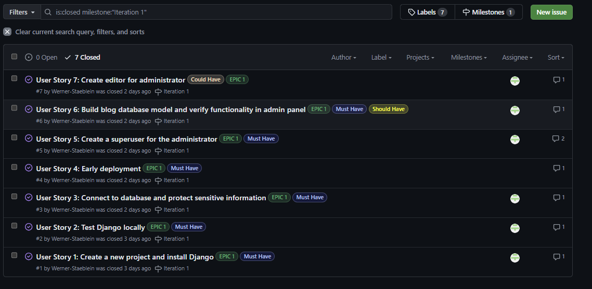
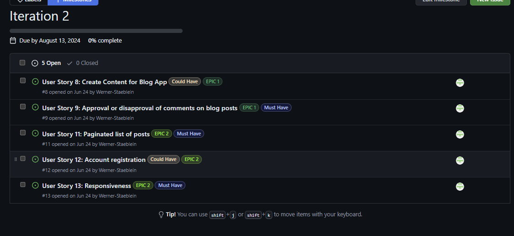

# Agile development process

I have used GitHub Projects to create a kanban board / collection of initial user stories to facilitate the implementation of agile development.

Three different EPICS were drafted. The EPICs are then broken down into user stories. 

The EPICS are:
-	Django setup and administrator/superuser
-	EPIC for unregistered users
-	EPIC for registered users

Some of the user stories that pertain to a certain EPIC may overlap with another EPIC. The reason is that some functionality available for superuser/admin likewise overlaps with the features planned for registered users.
GitHub projects was used to create the Kanban board to track the development of the user stories created for this project. The user stories are listed in the Kanban board created.

The Kanban board can be found here: 
[Project 24 by Werner-Staeblein](https://github.com/users/Werner-Staeblein/projects/24)

## Iteration 1 | Milestone 1

My first sprint was planned to take place between Aug. 5, 2024 and Aug. 12, 2024. For my first iteration I created milestone 1 with a total of 8 users stories from my kanban board to be worked on.
The distribution of "must have" to "could have"/"should have" was not the perfect 60%/40% at this stage but three of eight user stories were assigned could have/should have for iteration 1 as it was
not perfectly clear at the start of the iteration whether users stories 6,7, and 8 can be completed in the timeframe set for the first sprint (iteration 1).

Documentation of progress:

- Despite the hickup of renaming my Django testing folder with subsequent adjustments to wsgi, settings, asgi to capture the new named "assigned" to the Django project, the first iteration proceeded surprisingly well. The "must have" user stories were closed on the second day into the sprint/iteration 1
- Progress with iteration 1 supported by careful planning of all users stories in advance and revisiting the LMS material notes
- Creation of content for blog app most time-consuming user story in Iteration 1 as expected with almost one working day spent on collecting data and writing the blog app content
- Iteration 1 was completed on Aug. 8, 2024 and much faster than expected. The intial "could have"/"should have" user stories have proven to be less time-consuming than planned
- User Story 8 was moved back to the Kanban board to be worked on with the remaining user stories in subsequent iterations. User Story 8 covers the creation of content for the blog app and further content in addition to that already uploaded via fixtures/posts.json in iteraion 1 may be added in upcomin iterations

## Iteration 2 | Milestone 2

With the Iteration 1 completed much faster than anticipated, I decided to make a "mini-sprint" or smaller iteration 2 as a subsequent step.
Starting with Iteration 2, manual testing and creation of a testing board in an excel spreadsheet will start alongside the user stories assigned to this Iteration 2. The split of user stories is 60% "Must have" und 40% "Could have" user stories from my kanban board to be worked on.

Particular focus during Milestone 2 will be on further testing the deployed version of the blog app.

Documentation of progress:

- I made the mistake of including in my base.html the full navigation bar even though this was/is not laid out as an AC in the user story number 8. As a result, I had to work on a number of errors messages until I have the blog post database entries (means: everything that is already included in the database as blog content) visible on screen
- The folder structure of ROOT/TEMPLATES/base.html and DJANGO_APP(not being the djanog project named diviblog but rather the app named blog)/TEMPLATES/BLOG/index.html was time-consuming to set up properly. I revisited LMS learning material several times to grasp the logic of the folder structure
- Lesson learned in Iteration 2: Don't try to fully grasp every detail of LMS material and subsequently try to code "independently" assuming as if one LMS instruction and revisit of instructions there enable oneself to code the step with no error messages
- Still working on the first user story of iteration 2, I learned to not have defined a user story for the landing page of the dividend blog app. A new user story, #23, was created and added to iteration 2/sprint 2 milestone board
  
![Milestone_Board_after_Iteration_2]

