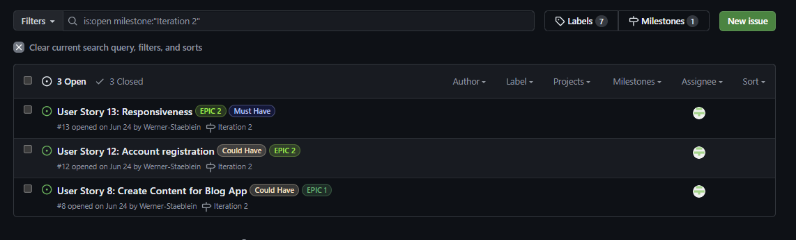
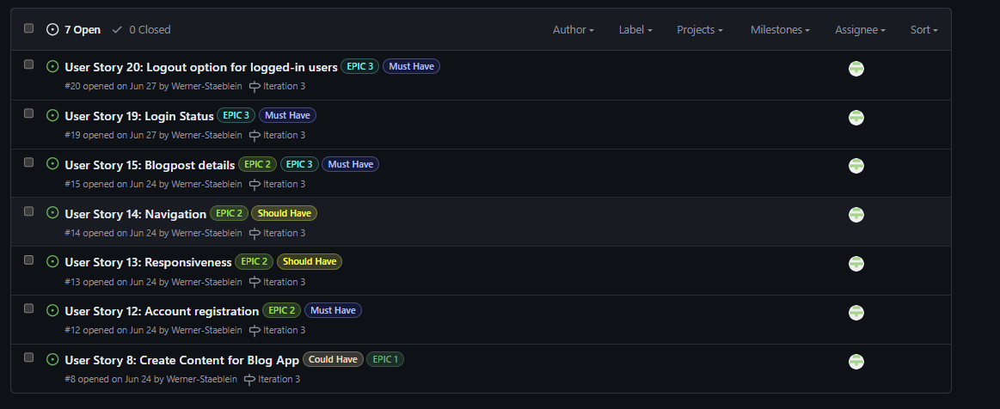
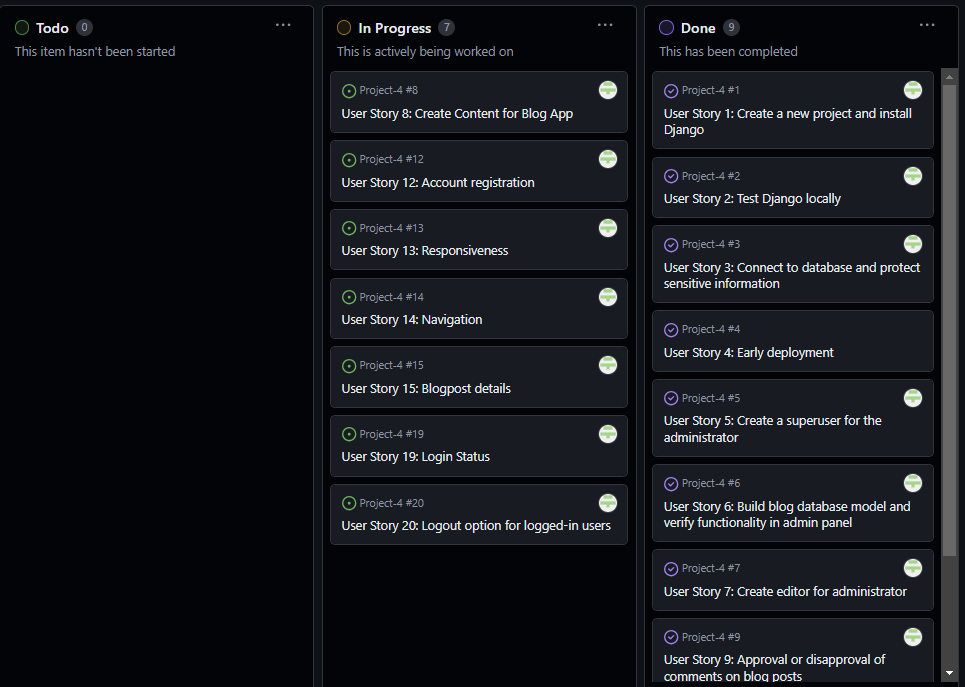
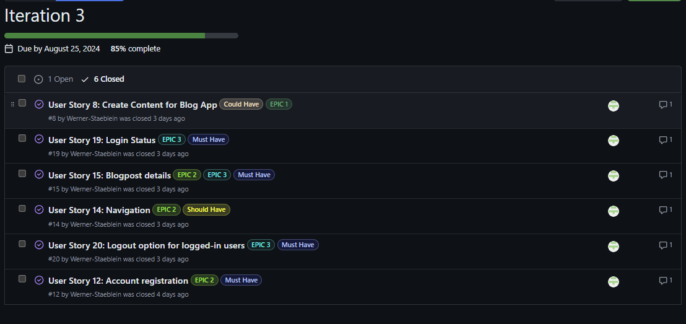
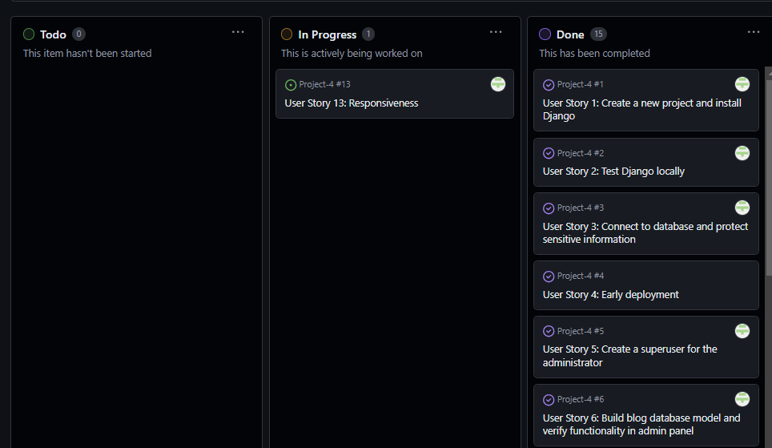
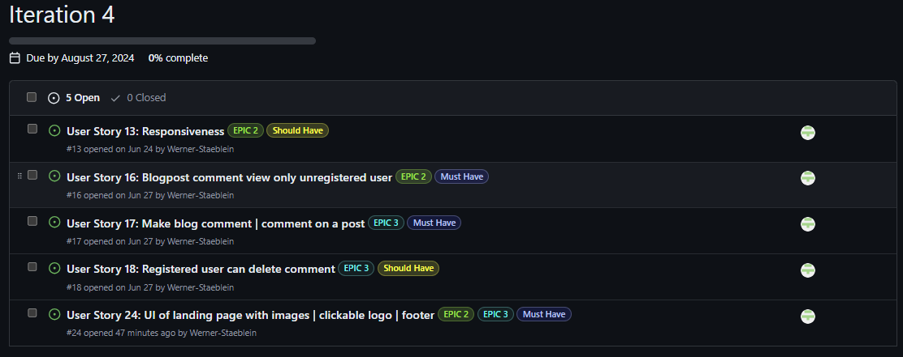
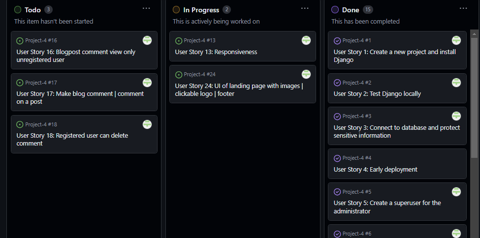
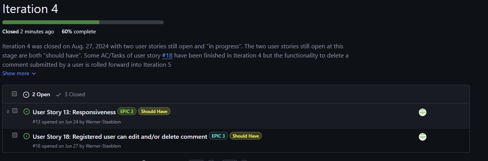
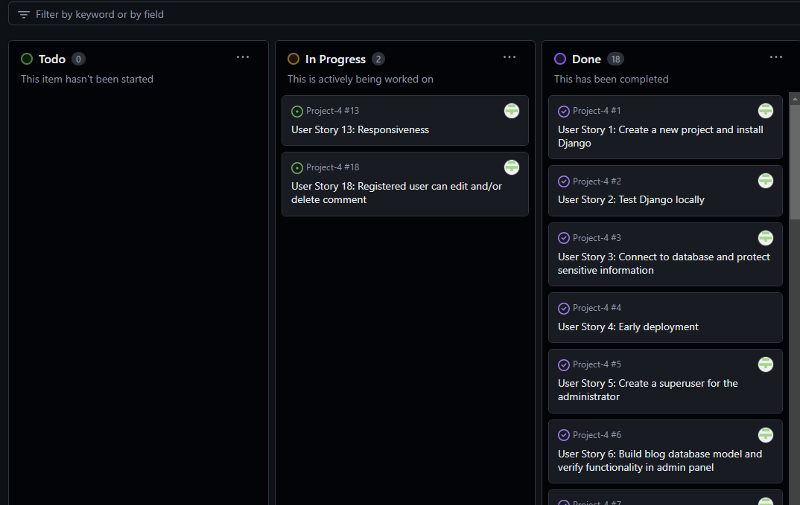

# Agile development process

I have used GitHub Projects to create a kanban board / collection of initial user stories to facilitate the implementation of agile development.

Three different EPICS were drafted. The EPICs are then broken down into user stories. 

The EPICS are:
-	Django setup and administrator/superuser
-	EPIC for unregistered users
-	EPIC for registered users

Some of the user stories that pertain to a certain EPIC may overlap with another EPIC. The reason is that some functionality available for superuser/admin likewise overlaps with the features planned for registered users.
GitHub projects was used to create the Kanban board to track the development of the user stories created for this project. The user stories are listed in the Kanban board created.

The Kanban board can be found here: 
**[Project 4 by Werner-Staeblein](https://github.com/users/Werner-Staeblein/projects/24)**

## Iteration 1 | Milestone 1

My first sprint was planned to take place between Aug. 5, 2024 and Aug. 12, 2024. For my first iteration I created milestone 1 with a total of 8 users stories from my kanban board to be worked on.
The distribution of "must have" to "could have"/"should have" was not the perfect 60%/40% at this stage but three of eight user stories were assigned could have/should have for iteration 1 as it was
not perfectly clear at the start of the iteration whether users stories 6,7, and 8 can be completed in the timeframe set for the first sprint (iteration 1).

**Iteration 1 | Milestone 1 at the start of Iteration 1**

Documentation of progress:

- Despite the hickup of renaming my Django testing folder with subsequent adjustments to wsgi, settings, asgi to capture the new named "assigned" to the Django project, the first iteration proceeded surprisingly well. The "must have" user stories were closed on the second day into the sprint/iteration 1
- Progress with iteration 1 supported by careful planning of all users stories in advance and revisiting the LMS material notes
- Creation of content for blog app most time-consuming user story in Iteration 1 as expected with almost one working day spent on collecting data and writing the blog app content
- Iteration 1 was completed on Aug. 8, 2024 and much faster than expected. The intial "could have"/"should have" user stories have proven to be less time-consuming than planned
- User Story 8 was moved back to the Kanban board to be worked on with the remaining user stories in subsequent iterations. User Story 8 covers the creation of content for the blog app and further content in addition to that already uploaded via fixtures/posts.json in iteraion 1 may be added in upcomin iterations

**Iteration 1 | Milestone 1 at the end of Iteration 1**

## Iteration 2 | Milestone 2

With Iteration 1 completed much faster than anticipated, I decided to make a "mini-sprint" or smaller iteration 2 as a subsequent step.
Starting with Iteration 2, manual testing and the creation of a testing board in an Excel spreadsheet will start alongside the user stories assigned to Iteration 2. The split of user stories is 60% "Must have" and 40% "Could have" user stories from my Kanban board to be worked on.

Particular focus during Milestone 2 will be on further testing the deployed version of the blog app.

**Iteration 2 | Milestone 2 at the start of Iteration 2**

Documentation of progress:

- I made the mistake of including in my base.html the full navigation bar even though this was/is not laid out as an AC in the user story number 8. As a result, I had to work on a number of error messages until I had the blog post database entries (which means: everything that is already included in the database as blog content) visible on the screen
- The folder structure of ROOT/TEMPLATES/base.html and DJANGO_APP(not being the Django project named diviblog but rather the app named blog)/TEMPLATES/BLOG/index.html was time-consuming to set up properly. I revisited LMS learning material several times to grasp the logic of the folder structure
- Lesson learned in Iteration 2: Don't try to fully grasp every detail of LMS material and subsequently try to code "independently" assuming that one LMS instruction and revisit of instructions there enable oneself to code the step with no error messages
- Still working on the first user story of iteration 2, I learned not to have defined a user story for the landing page of the dividend blog app. A new user story, #23, was created and added to iteration 2/sprint 2 milestone board
- Interim testing on accessibility resulted in lighthouse results of only 95%. As a result: As good as the intentions were to use a certain color scheme, this color scheme had to be adjusted to improve lighthouse scoring on accessibility. The basic idea of using blue/gray colors, as described in the README, however, maintained
- Half-way through the Iteration 2, I realised that the "mini-sprint" thought to be less time-consuming than Iteration 1 has proven to be more time-consuming than originally thought. Customizing CSS, synchronising CSS-classes and interim testing has taken more time than anticipated
- Iteration 2 was closed with three user stories still open of which two (#12/#8) were "should have" and one was "must have" (# 13 responsinveness). Further responsiveness testing will be done until the end of the project and user story +13 (responsivness) will remain in the backlog and will not be closed

**Iteration 2 | Milestone 2 at the end of Iteration 2**

## Iteration 3 | Milestone 3

Iteration 3 has a major focus on account registration, display of login status for users and log-in/log-out functionalities. The iteration was split to have 50% "must have" user stories with remaining half categorized as "should have/could have". The user stories were moved "in progress" in the Kanban board at the start of iteration 3.

**Iteration 3 | Milestone 3 at the start of Iteration 3**

**Kanban board before start of Iteration 3**

Documentation of progress:

- "Iteration 3 went very smoothly. The 'must-have' user stories were closed quickly, partly due to greater familiarity with the already established code base.
- I conducted interim testing, including validation of CSS, HTML, and responsiveness, to ensure that issues do not arise at the end of the project, thereby 'creating quality in the process.'
- In Iteration 3 I added the 404.html page. This step was very time-consuming. The reason is that I referenced "landing" in my 404.html rather than root "/". For this reason I struggled for a long time with 500 errors. I tried 404 test pages and still faced 500 errors until I realised that this might be related to the re-routing from the 404 page back to the "homepage". In addition, and as documented in the README.md, I had struggles to style the 404.html page with my static/css/style.css and eventually decided to use an internal stylesheet in the 404.html so that this page has colors, fonts, and typography similar to the rest of the application
- Iteration 3 also included an interim deployment testing to ensure that the app is properly "deployable" at this stage
- I defined a new user story (#24) at the end of Iteration 3. This new user story mainly covers topics of the UI that I found to not have been defined properly at the beginning of the project (images, footer, clickable logo)
- What is left in the Kanban board after Iteration 3 is the user story for responsiveness. Responsiveness testing was done throughout Iteration 2 but further respononsiveness testing to continue in all subsequent iterations. For this reason, this user story will be picked up again in a subsequent iteration.

**Iteration 3 | Milestone 3 at the end of Iteration 3**

**Kanban board at the end ofIteration 3**

## Iteration 4 | Milestone 4

Iteration 4 has a major focus on the CRUD functionality for registered users. Split of user stories with three "must-have" and two "should-have". User story #13 and #24 moved to "In Progress" in Kanban board immediately at beginning.

**Iteration 4 | Milestone 4 at the start of Iteration 4**

**Kanban board before start of Iteration 4**

Documentation of progress:

- Iteration 4 went well for the first user stories. I did review the learning material again for 15 hours to see where my code can be improved and to try to understand that my codebase is written well enough for someone to read
- The last user story (implementing edit and delete) was time-consuming with all the custom CSS styles I have defined before. I made a makeover of the comment functionality for registered users to ensure that registered users can see the comments submitted but not yet approved
- Using crispy forms and building crispy forms into my codebase has turned out to be much more difficult than the learning material for crispy suggested
- On my final day of Iteration 4 I struggled with an error message "ERROR:  Failed to acquire permit to connect to the database. Too many database connection attempts are currently ongoing." for a few hours. I was not able to resolve the connection to the database myself and patiently used python manage.py runserver numerous times to have my code running locally
- Iteration 4 was closed on Aug. 27, 2024 as planned for this sprint leaving two user stories open. Both users stories were "should have" for Iteration 4. Both user stories will be rolled forward to Iteration 5. Some of the user story #18 (edit comments) was completed in Iteration 4 leaving only the functionality of "delete comment" to be worked on in Iteration 5
- Regular manual testing and validation of python code/html/css was done during Iteration 4 so that potential mistakes in the codebase can be spotted as eaerly as possible

**Iteration 4 | Milestone 4 at the end of Iteration 4**

**Kanban board at the end of Iteration 4**

## Iteration 5 | Milestone 5

Iteration 5 ...is about 

**Iteration 5 | Milestone 5 at the start of Iteration 4**

**Kanban board before start of Iteration 4**

Documentation of progress:

-
-
-
-

**Iteration 5 | Milestone 5 at the end of Iteration 5**

**Kanban board at the end of Iteration 5**

